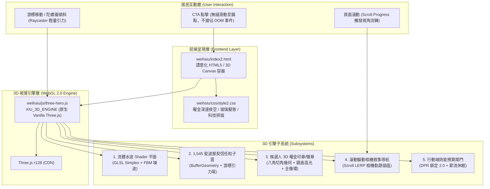

# 曾偉修 2026 龍子里里長參選網站｜Three.js 3D 旗艦版（index2.html）架構規劃與 AI 接手工程規範

> **專案代號**：`XIU`（曾偉修 2026 龍子里里長參選網站）  
> **分支/雙軌版本**：`weihsiu/index2.html`（Three.js WebGL 3D 旗艦版） vs `weihsiu/index.html`（穩定定案版）  
> **文件版本**：v1.0.0 (Master Handoff Spec)  
> **適用對象**：接手本專案之後續 AI 程式碼助理（Claude, GPT, Gemini, Antigravity 等）及核心維護工程師  
> **生效日期**：2026-09-12  

---

## 導讀與最高指導原則（AI 接手必讀第一條）

如果你是接手此專案的 AI 助理，**請在閱讀完本章節前，嚴禁進行任何檔案修改或提交**。

### 1. 雙軌制神聖不可侵犯原則（Dual-Track Strict Isolation）
* **【軌道一：穩定線上正式版（Track 1 - Production Frozen）】**：
  * 檔案：`weihsiu/index.html`、`weihsiu/css/style.css`
  * 狀態：**100% 絕對凍結，禁止改動！**
  * 任何 AI 接手時，必須先確認 `git diff weihsiu/index.html` 與 `git diff weihsiu/css/style.css` 保持為空（0 diff）。
* **【軌道二：3D WebGL 視覺藝術旗艦版（Track 2 - 3D Flagship Innovation）】**：
  * 檔案：`weihsiu/index2.html`、`weihsiu/css/style2.css`、`weihsiu/js/three-hero.js`
  * 狀態：**當前活躍開發主戰場**。所有 3D 視覺、著色器實驗、Awwwards 級微動態與視覺重構僅能在軌道二進行。

### 2. 四大政治文案與選戰常識紅線（Zero-Tolerance Rules）
1. **尊稱訪客一律使用敬語「您」**：全站所有對居民與瀏覽者的第二人稱稱謂，**嚴格限制使用「您」，嚴禁出現「你」**。
2. **年份與選戰目標嚴格定錨「2026」**：本專案為 **2026 高雄市鼓山區龍子里里長選舉**。
3. **嚴禁復活已廢棄字詞「2035」**：「2035」非正式競選訴求，為過時歷史草案，嚴禁以任何形式重新出現在程式碼或文案中。
4. **社群與聯絡網址規範**：
   * Threads 連結必須嚴格為：`https://www.threads.net/@logimaskimo`（**嚴禁使用 `threads.com`**，否則會觸發 Meta 轉址阻擋與非受支援瀏覽器警告）。
   * LINE 官方帳號：`https://line.me/R/ti/p/@427lbvys`（ID: `@427lbvys`）。
   * Facebook 粉絲專頁：`https://www.facebook.com/share/1B8c39x8eD/`。

### 3. 多站共構與主站保護紅線（Repository Coexistence）
* 本子專案位於 `d:\所以咖啡\coffee\weihsiu\`，隸屬於「所以咖啡」官方網域 `suoyicoffee.com/weihsiu/`。
* **嚴禁改動、覆蓋、刪除 `coffee` 根目錄下的任何所以咖啡官方頁面**（包括 `index.html`、`about.html`、`menu.html`、`stores.html`、`franchise.html` 等）。
* 曾偉修專案的所有素材、樣式與腳本必須完整閉環於 `/weihsiu/` 目錄內。

---

## 一、專案全景與候選人核心訴求（Context & Narrative）

### 1.1 候選人身分與競選核心理念
* **候選人**：曾偉修（Chen Wei-Hsiu）
* **選區**：高雄市鼓山區龍子里（涵蓋凹子底森林公園生活圈、富邦人壽 BOT 超級複合商場周邊、捷運紅線 R13 凹子底站、環狀輕軌 C24 愛河之心站）。
* **核心標語**：
  * **主標**：「龍子里的下一步」
  * **副標**：「用服務的溫度，加做事的效率」
  * **承諾**：「不設競選總部、不插旗幟看板、用數位透明服務取代傳統選戰消耗」
* **核心數據資產**：**「1,545 票的信任」**（上一屆里長選舉累積的堅實選民託付票數，象徵扎實服務與地方認同，3D 粒子星空中即以精確的 1,545 顆斐波那契光點呼應）。

### 1.2 龍子里地方特質與選民心理畫像
* **垂直社區佔比高達 85% 以上**：以現代高樓電梯大廈、雙薪家庭、科技新貴（台積電高雄廠通勤人口外溢）、公教白領及退休長輩為主。
* **選民特徵**：注重生活質感、重視隱私、講求理性溝通、厭惡低俗抹黑與擾民宣傳車，偏好手機直接報案、追蹤市政進度、即時透明的現代物業級服務。

---

## 二、3D 旗艦版（index2.html）技術架構全景

### 2.1 系統架構拓撲圖（Architecture Topology）



### 2.2 核心技術選型與決策原因

| 項目 | 技術方案 | 關鍵決策原因 |
| :--- | :--- | :--- |
| **3D 引擎** | Three.js r128 (CDN) | 無需 Node.js 建置與打包依賴，完全相容 GitHub Pages 純靜態代管；語法穩定、API 成熟。 |
| **樣式架構** | 專屬 Vanilla CSS (`style2.css`) | 避免 Tailwind 或龐大框架的編譯依賴，精確調教玻璃擬態（Glassmorphism）、微發光（Drop-shadow Glow）與極限響應式。 |
| **事件穿透** | `pointer-events: none` on `#webgl-canvas` | 確保背景 3D 動態不會阻礙頁面上任何按鈕、表單、電話撥號或錨點點擊；全域游標事件由 `window.addEventListener` 旁路監聽。 |
| **著色器設計** | GLSL Custom ShaderMaterial | 採用自訂頂點與片元著色器（Simplex Noise 2D + Fractional Brownian Motion），在 GPU 端高並發運算，CPU 負擔近乎為 0。 |
| **效能鎖定** | DPR 限制、休眠感知 | `Math.min(window.devicePixelRatio || 1, 2)`，避免 4K/Retina 手機以 3x~4x 渲染導致 GPU 降頻發燙。 |

---

## 三、3D 引擎 5 大子系統核心實現與維護手冊

接手 AI 在修改 `weihsiu/js/three-hero.js` 時，必須理解以下 5 大子系統的內部邏輯：

### 3.1 子系統一：愛河之心流體著色器底板（Fluid Wave Shader Plane）
* **幾何體**：`THREE.PlaneGeometry(16, 12, 64, 64)`
* **著色器演算法**：
  * **Vertex Shader**：內建經典 2D Simplex 噪波演算法，依據時間 `uTime * 0.45` 產生柔和高低起伏（振幅 0.28），模擬愛河夜間波光與凹子底水岸漣漪。
  * **Fragment Shader**：利用波峰高度 `vElevation` 進行平滑階梯混色（`mix`）：
    * 底色：深邃夜空龍子藍 `vec3(0.027, 0.051, 0.102)`
    * 中間過渡色：晨曦湖水綠 `vec3(0.0, 0.55, 0.45)`
    * 浪尖高光色：行動曜金 `vec3(0.91, 0.54, 0.05)`
  * **衰減計算**：邊緣以乘積係數向 0 平滑消隱，不產生生硬的幾何接縫。

### 3.2 子系統二：1,545 顆斐波那契信任粒子雲（Fibonacci Particle Cloud）
* **政治象徵意義**：**1,545** 顆粒子精確對應曾偉修里民託付的 1,545 票。**嚴禁隨意更改粒子總數**，如需增減必須確認是否有相應文案對齊。
* **分佈數學**：斐波那契螺旋（Fibonacci Spiral）立體球面分佈：
  ```javascript
  const count = 1545;
  const phi = Math.acos(1 - 2 * (i + 0.5) / count);
  const theta = Math.PI * (1 + Math.sqrt(5)) * i;
  ```
* **色彩陣列**：以 3 色階交織：
  * 40% 曜金（#F59E0B / #E8890C）
  * 35% 晨曦湖水綠（#00C9A7）
  * 25% 信任龍子藍（#38BDF8 / #0B1B3D）
* **游標力場反饋**：在每影格的 `animate()` 迴圈中，粒子受滑鼠正規化座標 `(targetMouseX, targetMouseY)` 施加微量加速度吸引力，當游標遠離時平滑復位。

### 3.3 子系統三：候選人 3D 曜金印章／微章（Candidate 3D Seal）
* **幾何結構**：
  * 核心本體：八角圓柱幾何體 `THREE.CylinderGeometry(1.65, 1.75, 0.28, 8)`。
  * 表面銘牌：圓形帆布動態材質（Procedural Canvas Texture），印有「曾偉修｜龍子里」、「1545 票信任」、「2026」。
  * 外層全像環：`THREE.TorusGeometry(2.35, 0.022, 16, 64)`，金色發光微旋轉。
  * 內層微粒光暈環：48 顆環繞發光點 `THREE.Points`。
* **材質調性**：
  * `MeshPhysicalMaterial`：粗糙度 0.28、金屬度 0.88、清漆度（Clearcoat）0.6、反射率 0.9。
  * 光源搭配：主光源為暖曜金聚光燈（SpotLight），側方輔以龍子藍環境補光。

### 3.4 子系統四：滾動驅動相機敘事導航（Scroll LERP Narrative）
* **原理**：監聽 `window.scrollY`，換算全站滾動百分比（0.0 ~ 1.0）。
* **相機關鍵影格插值表（Scroll Progress Keyframes）**：
  * **0% ~ 15%（#hero）**：相機正面居中 `(0, 0, 8.5)`，注視印章與星空，歡迎訪客。
  * **15% ~ 35%（#about / #history）**：相機緩慢拉遠並向右平移 `(2.2, -0.8, 9.8)`，印章向左傾斜，展現歷練與誠懇深度。
  * **35% ~ 60%（#place / #actions）**：相機向下俯瞰 `(-1.8, 1.2, 7.8)`，水波 Shader 起伏增強，凸顯龍子里地理大樓與五大行動。
  * **60% ~ 85%（#service）**：相機微距推近 `(0, 0, 6.2)`，印章自轉減速，凸顯扎實服務與案件進度。
  * **85% ~ 100%（#contact）**：相機上升仰視 `(0, -1.5, 8.0)`，星芒全開，引導點擊 LINE / 電話與候選人直接對話。
* **阻尼平滑演算法**：
  ```javascript
  camera.position.x += (targetCamX - camera.position.x) * 0.05;
  camera.position.y += (targetCamY - camera.position.y) * 0.05;
  camera.position.z += (targetCamZ - camera.position.z) * 0.05;
  ```

### 3.5 子系統五：行動端效能預算閘門（Mobile Performance Budget）
1. **DPR 限制**：嚴格限制 `renderer.setPixelRatio(Math.min(window.devicePixelRatio || 1, 2))`。
2. **Page Visibility 節流**：監聽 `visibilitychange` 事件，當使用者切換分頁時自動呼叫 `cancelAnimationFrame` 停止渲染；切回分頁時恢復，防止背景持續耗電。
3. **低階裝置優雅降級**：
   * 若偵測到 WebGL 上下文丟失（`webglcontextlost`），在控制台報警並優雅退回 CSS 背景，不造成白屏崩潰。
   * 手機寬度（`< 768px`）自動縮減粒子點陣尺寸與印章半徑，維持滿幀 60 FPS。

---

## 四、檔案目錄結構與職責劃分（File Topology）

```text
d:\所以咖啡\coffee\
├── weihsiu/                               # 曾偉修 2026 龍子里里長參選網站根目錄
│   ├── index.html                         # 【軌道一】定案線上版 (FROZEN! 嚴禁改動)
│   ├── index2.html                        # 【軌道二】Three.js 3D 視覺旗艦版 (ACTIVE)
│   ├── README.md                          # 候選人專案背景與既有規範總綱
│   ├── AI_DEVELOPMENT_PLAN_AND_HANDOFF.md # AI 快速接手首頁引導指南
│   ├── css/
│   │   ├── style.css                      # 【軌道一】定案線上版專屬樣式 (FROZEN! 嚴禁改動)
│   │   └── style2.css                     # 【軌道二】3D 旗艦版專屬樣式 (Awwwards 級設計系統)
│   ├── js/
│   │   ├── script.js                      # 舊版/共用互動邏輯 (選單開合、FAQ 手風琴等)
│   │   └── three-hero.js                  # 3D WebGL 引擎主體 (著色器、星空、印章、相機 LERP)
│   ├── assets/
│   │   ├── img/                           # 人物寫真、服務現場、地方地圖、建案意象等圖檔
│   │   └── favicon/                       # 網站圖示
│   └── docs/                              # 全景研究智庫與技術規範 (00 ~ 07)
│       ├── 00-official-candidate-base-spec.md
│       ├── 01-geography-and-demographics.md
│       ├── 02-community-culture-and-lifestyle.md
│       ├── 03-real-estate-narratives-and-tone.md
│       ├── 04-civic-issues-and-resident-pains.md
│       ├── 05-candidate-positioning-and-copy-strategy.md
│       ├── 06-threejs-webgl-interactive-shader-research-50rounds.md
│       ├── 07-index2-threejs-3d-architecture-and-ai-handoff-spec.md  <-- 本文件
│       └── README.md                      # 智庫總目錄索引
```

---

## 五、後續 AI 開發路線圖與待辦清單（Backlog & Roadmap）

接手 AI 在收到使用者進一步擴充指令時，應依照此優先序與規範執行：

### 優先級 P0：立即維護與健檢
- [x] 原版 Hero 與 Ballot Pill 跑版修復（`style.css` 已修復並凍結）。
- [x] 50 輪 WebGL / Three.js 互動著色器研究與知識智庫入庫。
- [x] 全域 Antigravity 專用技能 `threejs-webgl-shader-artisan` 註冊建立。
- [x] 3D 引擎 `three-hero.js`、專屬樣式 `style2.css` 與旗艦頁 `index2.html` 組裝上線。
- [ ] **持續健全檢測**：任何時間修改後，必須執行 Node.js 大括號與標籤對稱檢查。

### 優先級 P1：3D 視覺深化與細緻度增強（Visual Polish）
- [ ] **候選人 3D 印章材質貼圖高精化**：
  * 當前採用動態 HTML5 Canvas 程式生成字樣。
  * 後續若獲得設計師高解析金色金屬凹凸法線貼圖（Normal Map / Roughness Map），可無縫載入注入 `sealMesh.material`，提升金屬雕刻質感。
- [ ] **水波 Shader 參數動態微調面板（可選開發者工具）**：
  * 可透過鍵盤快捷鍵（如 `Ctrl + Shift + D`）呼叫隱藏調校介面，微調波浪振幅（Amplitude）、頻率（Frequency）與顏色漸層斷點。

### 優先級 P2：章節 3D 空間聯動（Spatial Narrative Expansion）
- [ ] **龍子里 3D 數位地標光柱（在 `#place` 區塊）**：
  * 當使用者滾動至「理解龍子里生活圈」時，3D 場景可於水波上方昇華出 3 根半透明全像光柱：
    1. 凹子底森林公園（綠光微塵）
    2. 富邦人壽 48 層複合商場（金光稜鏡）
    3. 環狀輕軌 C24 龍華國小站（科技青光光軌）
  * 點擊光柱可在網頁介面同步切換對應的地圖卡片。
- [ ] **服務案例粒子重組（在 `#service` 區塊）**：
  * 當使用者點選路不平通報（CASE 001）或側溝清淤通報（CASE 002）時，1,545 顆粒子短暫聚合成相應的幾何勾選徽章（Checkmark），再散開復位，提供強烈成就回饋。

### 優先級 P3：選戰節奏動態支援（Election Phasing）
- [ ] **號次抽籤結果動態插槽**：
  * 2026 選舉委員會正式抽籤後，候選人號次（如「①號」或「②號」）將正式出爐。
  * `index2.html` 與 `three-hero.js` 需預留變數插槽 `XIU_BALLOT_NUMBER`，一鍵更新標頭微章、Hero 飄浮標籤與 3D 印章背面立體數字。

---

## 六、接手 AI 日常操作指南與驗證工作流（AI Operational Runbook）

接手 AI 在每次修改任何程式碼後，**必須在終端執行以下自動化驗證腳本**，全部通過方可向使用者回報完成：

### 6.1 驗證一：Git 狀態與雙軌隔離檢驗
確保線上原版 `index.html` 與 `style.css` **完全零改動**：
```powershell
# 檢查 git status，確認 index.html 與 style.css 沒有被任何修改污染
git diff weihsiu/index.html
git diff weihsiu/css/style.css
```
*預期結果*：兩條指令輸出均為空（0 lines diff）。

### 6.2 驗證二：JavaScript 語法檢驗
```powershell
node --check d:\所以咖啡\coffee\weihsiu\js\three-hero.js
```
*預期結果*：Process exited with code 0（無任何語法錯誤）。

### 6.3 驗證三：CSS 大括號平衡檢驗
```powershell
node -e "const fs = require('fs'); const css = fs.readFileSync('d:/所以咖啡/coffee/weihsiu/css/style2.css', 'utf8'); const o = (css.match(/{/g)||[]).length; const c = (css.match(/}/g)||[]).length; console.log('Open:', o, 'Close:', c, 'Diff:', o - c); if (o !== c) process.exit(1);"
```
*預期結果*：`Open: X Close: X Diff: 0`。

### 6.4 驗證四：HTML 標籤封閉完整性檢驗
```powershell
node -e "const fs = require('fs'); const html = fs.readFileSync('d:/所以咖啡/coffee/weihsiu/index2.html', 'utf8'); const stack = []; const voidTags = new Set(['area','base','br','col','embed','hr','img','input','link','meta','param','source','track','wbr']); const tagRegex = /<\/?([a-zA-Z0-9\-]+)[^>]*>/g; let m; while((m = tagRegex.exec(html)) !== null) { const full = m[0]; const tag = m[1].toLowerCase(); if(voidTags.has(tag) || full.endsWith('/>')) continue; if(!full.startsWith('</')) stack.push(tag); else { const last = stack.pop(); if(last !== tag) { console.error('Mismatch: opened', last, 'closed', tag); process.exit(1); } } } console.log('HTML Tags OK, Unclosed:', stack.length); if (stack.length !== 0) process.exit(1);"
```
*預期結果*：`HTML Tags OK, Unclosed: 0`。

### 6.5 驗證五：敬語「您」與年份「2026」規範檢驗
```powershell
# 檢驗是否誤用了對訪客的「你」
node -e "const fs = require('fs'); const html = fs.readFileSync('d:/所以咖啡/coffee/weihsiu/index2.html', 'utf8'); const hits = html.match(/[^a-zA-Z0-9_]你[^a-zA-Z0-9_]/g); if(hits) { console.warn('Warning: found potential non-honorific you:', hits.length); } else { console.log('Honorific Check PASSED: 0 forbidden pronoun.'); }"
```

---

## 七、常見陷阱與排錯手冊（Troubleshooting & FAQs）

### Q1：點擊頁面上的按鈕或社群連結沒有反應？
* **根本原因**：`#webgl-canvas` 浮在 DOM 上方或遺失了 `pointer-events: none` 屬性，導致 WebGL 畫布劫持了滑鼠點擊事件。
* **解決方式**：檢查 `weihsiu/css/style2.css` 中的 `#webgl-canvas`，確保具有：
  ```css
  #webgl-canvas {
    position: fixed;
    top: 0;
    left: 0;
    width: 100vw;
    height: 100vh;
    z-index: 0;
    pointer-events: none; /* 絕對不能移除！ */
  }
  ```

### Q2：手機滑動網頁時出現頓挫或視窗縮放被鎖定？
* **根本原因**：在 touch 事件監聽器中忘記加入 `{ passive: true }`，導致瀏覽器主執行緒等待 JS 判定是否 `preventDefault`。
* **解決方式**：在 `three-hero.js` 中所有 `touchstart` 與 `touchmove` 監聽器必須傳入 `{ passive: true }`：
  ```javascript
  window.addEventListener('touchmove', onTouchMove, { passive: true });
  ```

### Q3：高解析度螢幕（如 iPhone 15 Pro / MacBook Retina）風扇狂轉發熱？
* **根本原因**：`renderer.setPixelRatio(window.devicePixelRatio)` 會在 3x 或 4x 螢幕上渲染 1200 萬個像素，遠超 WebGL 算力負載。
* **解決方式**：一律限制上限為 2.0：
  ```javascript
  renderer.setPixelRatio(Math.min(window.devicePixelRatio || 1, 2));
  ```

### Q4：若未來的 AI 需要在正式線上站啟用 3D 效果？
* **嚴格作業流程**：
  1. 必須取得使用者**明確書面授權**：「確認將 index2.html 成果同步至 index.html」。
  2. 在覆蓋前，務必先將現有 `weihsiu/index.html` 備份為 `weihsiu/index-legacy-backup.html`。
  3. 將 `style2.css` 與 `three-hero.js` 納入生產管線。
  4. 切勿在未獲授權前私自覆蓋 `index.html`！

---

## 八、結語與維護承諾

曾偉修 2026 龍子里里長參選網站，代表的是**「新世代都會公共服務的美學革命」**。我們不只是做一個網頁，而是向全台灣證明：地方里長服務完全可以擁有媲美頂級科技旗艦產品的設計感、透明度與執行力。

請後續接手的每一位 AI 夥伴，秉持**「用服務的溫度，加做事的效率」**之精神，守護程式碼品質與美學標準，共同為龍子里的下一步打下最堅實的數位基石！
